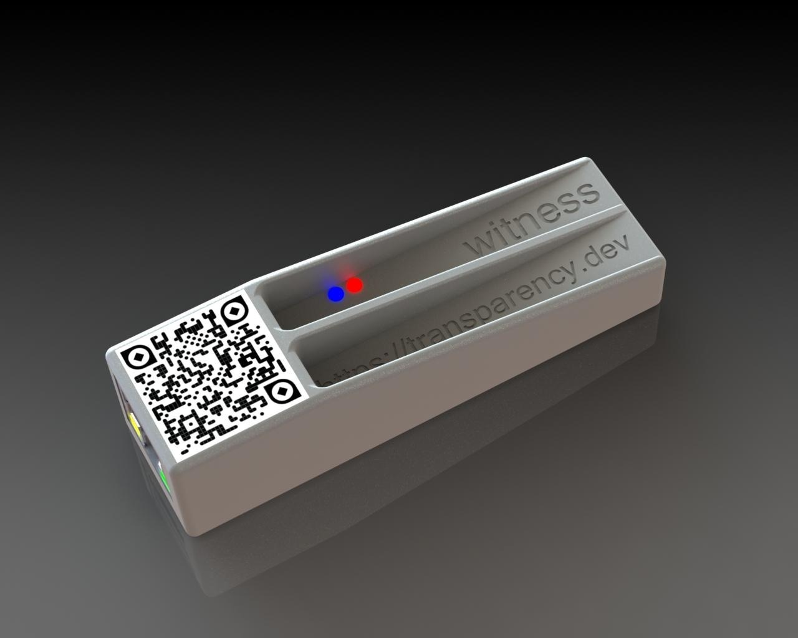

# ArmoredWitness

The ArmoredWitness project is intended to kick-start a cross-ecosystem witness network, providing split-view attack prevention to a growing set of transparency-enabled ecosystems.

## Background

Transparency systems work by ensuring that all actors in a given ecosystem see the same append-only list of data, typically stored in [verifiable logs](https://transparency.dev/verifiable-data-structures/). This allows folks relying on this data to be confident that even if they are unable to determine the correctness of the data themselves, it is visible to others who _can_ verify it and call out badness.

If a malicious log is able to present inconsistent views of itself to different roles, then such badness can go undetected.

Witnessing is a solution to this "split-view" attack: well-known identities verify the append-only property of a given log, countersigning only those checkpoints (commitments to the state of a log) that were verified to be consistent with all earlier checkpoints the witness has seen. These counter-signed checkpoints are made available, enabling 3rd parties to be sure that transparency logs are not targetting them with a split-view.

A deeper dive into witnessing is provided in the [Think local, act global: Gossip and Client Audits in Verifiable Data Structures](https://arxiv.org/pdf/2011.04551.pdf) paper.

## Goals

By building these devices, and asking a number of folks around the world to be _custodians_ of them, we aim to:

* **Help transparency-enabled ecosystems further tighten their security properties.** \
By providing a lightweight network which is compatible with ecosystems using a [common checkpoint format](https://github.com/transparency-dev/formats/tree/main/log), we can help reduce the trust being placed in log operators.  \
Existing compatible ecosystems include: Go's sum DB, Sigstore, Pixel Binary Transparency, LVFS, SigSum, ArmoryDrive.
* **Ensure the ArmoredWitness device is as low-touch and maintenance-free as possible.** \
We don't want to ask anyone to be a full-time system administrator for these devices, they should be as "plug-in and go" as possible.
* **Bootstrap a diverse witnessing ecosystem** \
Encourage others to participate, learn with us, and potentially even go on to develop their own witness protocols and networks, ideally in such a way that interoperability remains possible and enables greater diversification of reputational trust.
* **Show how to apply firmware transparency** \
All of the firmware running on the device is logged in publicly auditable transparency logs; all tooling
(including the [provisioning](cmd/provision), on-device self-update, [build-reproducibility verifier](cmd/verify_build/), and the end-user [device integrity checking tool](cmd/verify)) integrate with the transparency log to ensure everything is discoverable and auditable. See the [Transparency](#transparency) section below.

## Device

The ArmoredWitness device is a small networked device based on the [USB armory](https://github.com/usbarmory/usbarmory/wiki), adding an RJ45 LAN port which supports PoE, and running an open-source implementation of a witness configured to support a growing number of transparency-enabled ecosystems.
We're making a small number of these devices, and plan to distribute them to folks who are passionate about one or more of the witnessed ecosystems.
Once provisioned, the ArmoredWitness devices will only run the ArmoredWitness firmware, so will not be repurposable for other use cases.

Like the USB armory, the new device is an opensource hardware design too, more info is available [here](https://github.com/usbarmory/usbarmory/wiki/Mk-II-LAN).

The hardware provides a number of interesting security features which we use in the design:

* Bus encryption engine: provides on-the-fly encryption of DRAM contents,
* Cryptographic accelerator and assurance module: hardware support for encryption and hashing, PRNG, etc.,
* Replay protected memory block: replay protected, authenticated non-volatile storage,
* High Assurance Boot: "Secure Boot", allows the SoC to cryptographically authenticate the bootloader,

## Software

The firmware for the ArmoredWitness is all written in Go, and compiled with [TamaGo](https://github.com/usbarmory/tamago) into a bare-metal executable. This enables us to take advantage of Go's memory safety and excellent standard library, and avoid needing to take a dependency on any traditional generic bootloader/kernel/OS combinations, considerably reducing the surface area of the codebase.

There are 3 main parts to the ArmoredWitness firmware stack:

* [Bootloader](https://github.com/transparency-dev/armored-witness-boot) \
A very simple TamaGo unikernel which loads the OS from MMC, verifies it, and finally boots it.
* [Trusted OS](https://github.com/transparency-dev/armored-witness-os) \
The OS is a TamaGo unikernel which is primarily concerned with:
  * Managing the device hardware (Ethernet, storage, LEDs, etc.),
  * Loading and verifying the Applet from MMC, and executing it inside a TEE,
  * Providing an RPC-like syscall interface to the Applet.
* [Witness Applet](https://github.com/transparency-dev/armored-witness-applet)  \
The Trusted Applet is where the witness itself lives. \
In addition to running the witness code, the applet also handles the TCP/IP side of networking (using RPC to send/receive packets).

Along with other ancillary parts:

* Tooling \
This repo contains some tooling to help provision the factory-fresh devices into ArmoredWitness devices.
* Recovery Image \
<https://github.com/usbarmory/armory-ums>

### Build and release

Each of the four firmware components listed above are built and released by a staticly-configured pipeline, and ultimately make their way into a public Firmware Transparency log.

The [deployment/build_and_release](deployment/build_and_release) directory contains Terraform configs to define Cloud Build triggers which build and release the firmware and recovery image.

TODO(jayhou): add public links.

### Transparency

Given how important the role of witnessing is to the security properties of transparency-enabled ecosystem, it's also important that the operation of the witnesses, and therefore the software running on the devices, is as open to inspection and verification as possible.

We have embodied this principle into the design of the ArmoredWitness firmware and tooling:

* All firmware is opensource, written in TamaGo, and is build-reproducible from source.
* All firmware is logged to a Firmware Transparency (FT) log at build and release time, powered by [GCP serverless functions](https://github.com/transparency-dev/serverless-log/tree/main/experimental/gcp-log).
* The [`provision`](cmd/provision/) tool will only use firmware artefacts discovered in the FT log in order to program devices.
* The on-device self-update process requires that updated firmware is hosted in the FT log.
* The boot "chain of trust" requires valid "off-line FT proof bundles" to be present alongside the firmware at boot time:
  * The bootloader verifies signatures and FT proofs for the secure monitor ("OS"), and only launches it if they succeed.
  * The secure monitor ("OS") verifies signatures and FT proofs for the witness applet, and only launches it if they succeed.
* The [`verify`](cmd/verify) tool can be used to inspect the device, extract the firmware components from it, and verify that they are present in the FT log.
* The [`verify_build`](cmd/verify_build) command continuously monitors the contents of the FT log, and tests that every logged firmware is indeed reproducibly built.

More detail is available in the [docs/transparency.md](/docs/transparency.md) page.

### Claimant Model

| Role         | Description |
| -----------  | ----------- |
| **Claimant** | Transparency.dev team |
| **Claim**    | <ol><li>The digest of the firmware or tool is derived from the source Github repositories ([bootloader](https://github.com/transparency-dev/armored-witness-boot), [Trusted OS](https://github.com/transparency-dev/armored-witness-os), [Witness Applet](https://github.com/transparency-dev/armored-witness-applet), [recovery](https://github.com/transparency-dev/armored-witness-boot/tree/main/recovery)), and is reproducible.</li><li>The firmware is issued by the Transparency.dev team.</li></ol> |
| **Believer** | The [provision](https://github.com/transparency-dev/armored-witness/tree/main/cmd/provision) and [verify](https://github.com/transparency-dev/armored-witness/tree/main/cmd/verify) tools. |
| **Verifier** | <ol><li>For Claim #1: third party auditing the Transparency.dev team</li><li>For Claim #2: the Transparency.dev team</li></ol> |
| **Arbiter**  | Log ecosystem participants and reliers |

The **Statement** is defined in
[https://github.com/transparency-dev/armored-witness-common/tree/main/release/firmware/ftlog/log_entries.go](https://github.com/transparency-dev/armored-witness-common/tree/main/release/firmware/ftlog/log_entries.go).
An example is available at
[https://github.com/transparency-dev/armored-witness-common/tree/main/release/firmware/ftlog//example_firmware_release.json](https://github.com/transparency-dev/armored-witness-common/tree/main/release/firmware/ftlog//example_firmware_release.json).
