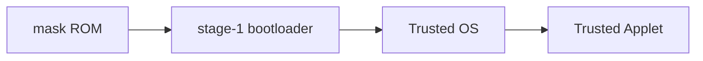

# Firmware Authentication, Verification, and Transparency

This readme describes the mechanism used in the ArmoredWitness to authenticate
the various pieces of firmware on the device, which, by virtue of being built
around firmware transparency, also enables 3rd parties to inspect and verify
their correctness.

## Firmware types

The ArmoredWitness project has 4 distinct units of firmware. These are:

1. [Boot loader](https://github.com/transparency-dev/armored-witness-boot)
1. [Trusted OS](https://github.com/transparency-dev/armored-witness-os)
1. [Trusted Applet](https://github.com/transparency-dev/armored-witness-applet)
1. [Recovery](https://github.com/usbarmory/armory-ums)

The first 3 firmware images listed above are flashed onto the device's internal
MMC storage, and enable the device to perform its witnessing role.

The final `Recovery` image is only used during device provisioning, or in the
unlikely case that the device becomes corrupted and can no longer boot.

## Chain of trust

During normal operation each stage authenticates the next, forming a chain of trust.

In production devices, this chain of trust is rooted in the i.MX
[HAB](https://github.com/usbarmory/usbarmory/wiki/Secure-boot-(Mk-II)) functionality,
which prevents a fused device from booting any stage-1 firmware that is not signed by
an authorised key.

From this point onwards, the authentication of subsequent stages all follow a similar
verification flow:

1. The next-stage firmware must be accompanied by a valid
   [`ProofBundle`](https://github.com/transparency-dev/armored-witness-common/blob/main/release/firmware/bundle.go#L21-L36)
   structure. \
   This structure contains [firmware transparency](#firmware-transparency) related
   artefacts, including:
   - a
     [release manifest](https://github.com/transparency-dev/armored-witness-common/blob/main/release/firmware/ftlog/log_entries.go#L33-L65)
     signed by one or more trusted identities, which describes the firmware and
     its (verifiably reproducible) provenance.
   - a [checkpoint](https://github.com/transparency-dev/formats/tree/main/log#checkpoint-format)
     from a known firmware transparency log which contains the above release
     manifest as one of its entries
   - the index of the manifest in the log, and its corresponding _inclusion proof_
1. The loader verifies:
   - the presence of one or more[^1] valid signatures on the manifest, then:
   - the SHA256 of the firmware binary matches the SHA256 in the signed manifest
   - the signature on the log checkpoint
   - the inclusion proof + manifest is valid for the given log checkpoint
1. If all checks pass, only then will the loader launch the subsequent stage.

[^1]: The Trusted OS requires two signatures, one from Google and one from WithSecure,
      The Trusted Applet requires just one signature from Google.

## Firmware Transparency

All firmware artefacts for the ArmoredWitness are made discoverable through the use of
Firmware Transparency. The goal is to make it hard for anyone to undertake a targeted
attack against the devices by creating a signed malicious firmware release, without
that attack also being easily detectable.

As described in the previous section, every release of each of the four types of firmware
for the ArmoredWitness _must_ be published into the transparency log to be usable on the
device (with the exception of the bootloader since the mask ROM is unable to enforce
the necessary firmware transparency verification[^2]); if the earlier boot stages are
unable to convince themselves that the subsequent stage is present in a log, they will
not launch the subsequent stage.

[^2]: However, the holder of the device will be able to verify that the installed
      bootloader is indeed present in the FT log themselves.

With entries required to be present in the log, two benefits are realised:

1. Google and WithSecure are able to quickly become aware of misuse of their signing
   identities to release unauthorised firmware updates.
1. Since the firmware is built with [TamaGo](https://github.com/usbarmory/tamago) (a
   port to Go which provides bare-metal support for Go binaries), the ArmoredWitness
   firmware is _reproducibly built_, so anyone in the world can verify that each firmware
   can be rebuilt from the claimed git commit, and inspect the entire source at that
   commit for any undesireable or malicious behaviour.

For more information about the transparency concepts mentioned above, please visit
<https://binary.transparency.dev>, as well as <https://transparency.dev> for more
general information.

If you have questions, or are interested in this topic come and say hello at
<https://transparency-dev.slack.com/>.

